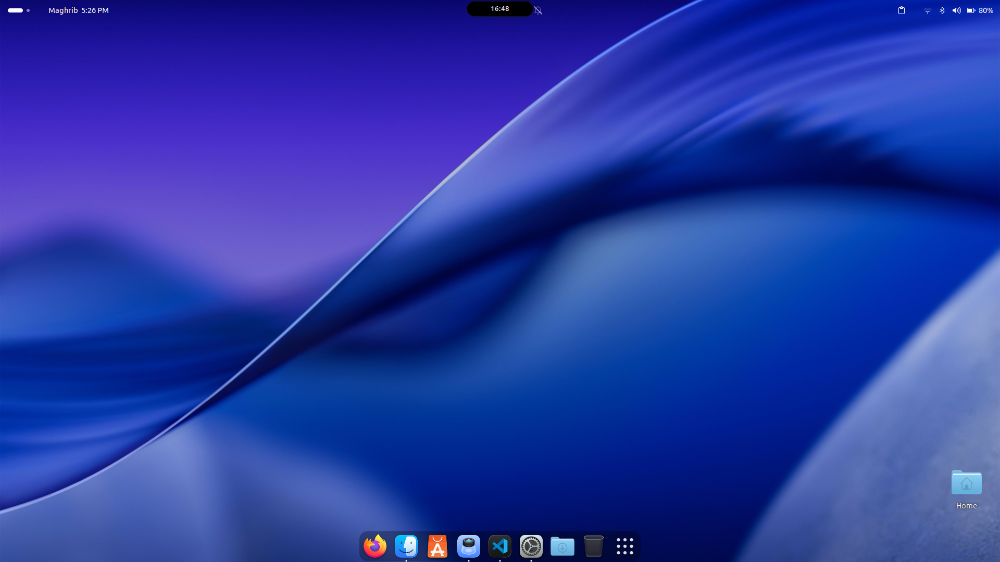
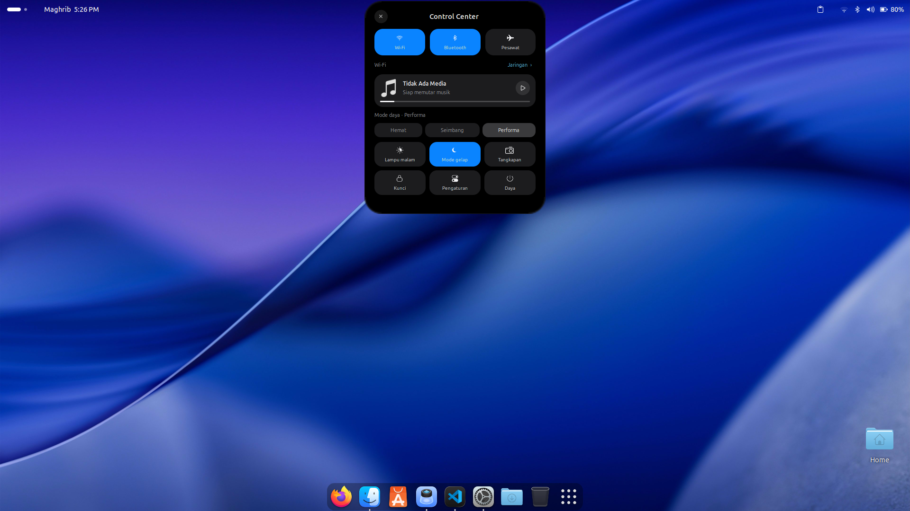
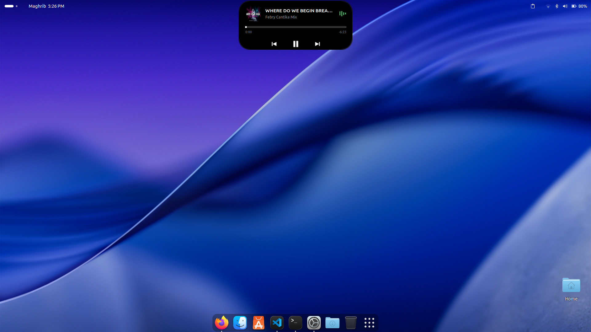

# Dynamic Island for GNOME

Ekstensi GNOME Shell yang menampilkan aktivitas sistem dalam pil ringkas,
terinspirasi Dynamic Island. Proyek komunitas, tidak berafiliasi dengan Apple.

Dibuat dan dikembangkan oleh **Akbar dev** · **Versi 1.0**

GitHub: [@ilhamakbarjamil](https://github.com/ilhamakbarjamil)

## Fitur

- Kontrol musik MPRIS, artwork, dan progres pemutaran.
- Notifikasi dengan pratinjau teks dan antrean berdasarkan prioritas.
- Pemantauan download, Bluetooth, VPN, workspace, dan mount drive.
- Indikator kamera dan mikrofon yang tetap terlihat di samping island.
- Status pengisian baterai, perekaman layar, volume, dan kecerahan.
- Pengaturan ukuran, posisi, durasi popup, dan toggle tiap fitur.
- Mode simulasi CLI tanpa memasang drive atau mengubah perangkat.

## Persyaratan

- **GNOME Shell 46**, sesuai `metadata.json`. Versi lain belum dinyatakan didukung.
- Bash, Python 3, dan `glib-compile-schemas` untuk instalasi.
- GJS dan libadwaita untuk preferensi GNOME.
- `fuser` untuk deteksi tambahan aplikasi yang membuka perangkat kamera langsung.
- `gsettings` dan `gdbus` untuk mode tes CLI; Node.js hanya untuk tes pengembangan.

## Tampilan Control Center

### Mode normal


### Mode expand


## Tampilan Musik

### Mode normal


### Mode expand


## Instalasi untuk pengguna baru

**Tidak perlu aplikasi Extension Manager, GNOME Tweaks, atau ekstensi browser.**
Program ini tetap merupakan ekstensi **GNOME Shell**, bukan aplikasi yang dapat
berjalan di semua desktop Linux. KDE Plasma, XFCE, Cinnamon, dan GNOME selain versi
46 belum didukung.

### 1. Periksa desktop

Buka Terminal dan jalankan:

```bash
gnome-shell --version
```

Hasilnya harus menunjukkan versi **46.x**. Installer juga memeriksa versi ini dan
berhenti sebelum menyalin file jika tidak sesuai. Jangan mematikan pemeriksaan
kompatibilitas GNOME untuk memaksakan versi lain.

### 2. Siapkan kebutuhan

Perintah berikut harus tersedia:

```bash
command -v python3 glib-compile-schemas gjs gnome-shell gnome-extensions
```

Jika ada yang belum tersedia, pasang melalui pengelola paket distribusi Anda.
Pada Ubuntu 24.04 dengan desktop GNOME, paket yang berkaitan adalah `python3`,
`libglib2.0-bin`, `gjs`, `gnome-shell`, dan `gir1.2-adw-1` untuk jendela pengaturan.
Paket `psmisc` menyediakan `fuser` untuk deteksi tambahan kamera.
Installer tidak memasang paket sistem dan tidak meminta `sudo`.

### 3. Unduh dan instal

Di GitHub, pilih **Code → Download ZIP**, ekstrak, lalu buka Terminal di folder
hasil ekstraksi yang berisi `install.sh`. Jalankan:

```bash
bash install.sh
```

Tidak perlu `chmod` jika menggunakan perintah di atas. Jalankan dari akun desktop
Anda, **tanpa sudo**.

Installer otomatis:

1. Memeriksa alat instalasi dan kompatibilitas GNOME.
2. Mengompilasi schema pengaturan, termasuk `gschemas.compiled`.
3. Mencadangkan instalasi lama, jika ada.
4. Memasang file runtime dan menyimpan aktivasi ekstensi.
5. Mencoba mengaktifkannya langsung di sesi GNOME yang berjalan.

File terpasang di `~/.local/share/gnome-shell/extensions/dynamic-island@ilhamakbarjamil.github.com`
atau direktori `XDG_DATA_HOME` Anda. Backup ada di `gnome-shell/extension-backups`
di lokasi data pengguna yang sama.

### 4. Jika island belum muncul

Simpan pekerjaan, **logout lalu login kembali**. Aktivasi sudah disimpan oleh
installer, jadi tidak perlu memasang Extension Manager atau mengulang instalasi.
Pembaruan kode instalasi lama juga memerlukan pemuatan ulang sesi pada Wayland.
Ini mengikuti [batasan restart GNOME Shell di Wayland](https://gjs.guide/extensions/development/debugging.html).
Installer tidak akan melakukan logout otomatis.

Jika semua ekstensi pengguna dinonaktifkan secara global, installer akan memberi
petunjuk. Untuk mengizinkannya kembali:

```bash
gsettings set org.gnome.shell disable-user-extensions false
```

Pengaturan global ini juga mengizinkan ekstensi lain yang sebelumnya diaktifkan.

Periksa status jika masih belum muncul:

```bash
gnome-extensions info dynamic-island@ilhamakbarjamil.github.com
```

Jika statusnya error, lihat log untuk menemukan penyebabnya:

```bash
journalctl --user -b -o cat | grep -i -E 'dynamic-island|JS ERROR'
```

### Opsi installer

- `bash install.sh`: pasang dan coba aktifkan otomatis.
- `bash install.sh --enable`: sama dengan perilaku default.
- `bash install.sh --no-enable`: hanya pasang file, untuk staging atau pengujian.
- `bash install.sh --help`: tampilkan bantuan.

Untuk memperbarui, unduh versi baru lalu jalankan `bash install.sh` lagi.

## Pengaturan

```bash
gnome-extensions prefs dynamic-island@ilhamakbarjamil.github.com
```

Perubahan preferensi diterapkan langsung. Menonaktifkan notifikasi kustom
mengembalikan pengaturan banner sistem sebelumnya.

## Tes tanpa perangkat

Dari folder proyek atau folder instalasi:

```bash
./tools/island-test enable
./tools/island-test mount
./tools/island-test reset
./tools/island-test disable
```

Skenario lain: `bluetooth`, `notification`, `download`, `privacy`, `vpn`, dan
`workspace`. Mode tes nonaktif secara default.
Lihat [panduan pengujian](docs/TESTING.md) untuk detail dan tes otomatis.

## Struktur proyek

```text
extension.js       Entry point dan integrasi UI GNOME Shell
prefs.js           Jendela pengaturan
metadata.json      Identitas dan kompatibilitas ekstensi
stylesheet.css     Tampilan GNOME St
src/               Watcher dan modul fitur
schemas/           Schema GSettings; hasil kompilasi tidak perlu di-commit
tools/island-test  CLI simulasi
install.sh         Installer untuk pengguna saat ini
tests/             Tes otomatis
docs/TESTING.md    Panduan pengujian
```

## Batasan

- Persentase download tidak dapat diketahui hanya dari ukuran file sementara;
  persentase simulasi bukan progres unduhan nyata.
- Deteksi kamera tambahan membaca perangkat video yang sedang dibuka, bukan
  bukti bahwa frame sedang direkam. Mikrofon mengikuti status penggunaan dan mute.
- Deteksi VPN berbasis NetworkManager dan interface merupakan indikator status,
  bukan verifikasi koneksi terenkripsi atau akses internet.
- Kehalusan animasi, scaling, dan dukungan perangkat perlu diuji pada sesi GNOME nyata.

## Persiapan publikasi

Sesuaikan URL repositori pada `metadata.json` sebelum publikasi. Tambahkan screenshot
hasil pengujian dan file `LICENSE` setelah menentukan lisensi yang diinginkan.
Repositori ini belum menetapkan lisensi penggunaan ulang.

## Developer

**akbar dev** — [@ilhamakbarjamil](https://github.com/ilhamakbarjamil)

Copyright © 2026 akbar dev.
